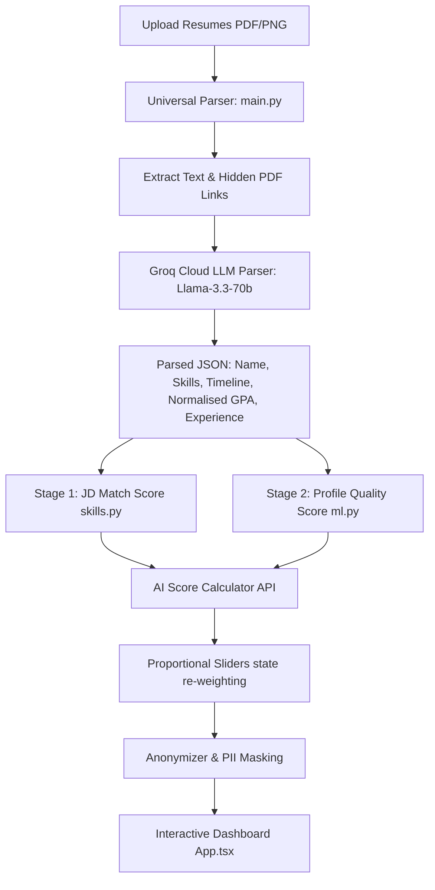

# Agentic Talent Screener (AI Recruiter) 🚀

A privacy-conscious candidate ranking and screening system. The application combines **Stage 1 JD-dependent semantic matching** (Sentence-Transformers) with **Stage 2 candidate profile quality evaluation** (LightGBM) to deliver objective, explainable suitability scores. It features a guardrailed recruitment chatbot, a resume auditor, automatic GitHub portfolio verification, and blind review mode.

---

## 🏗️ System Architecture



---

## 🌟 Key Features

### 1. 🤖 Interactive Sidebar Chat Agent (LangGraph & Llama-3)
*   Implements a **4-node LangGraph state machine** (`classify` $\rightarrow$ `refuse` or `inject` $\rightarrow$ `generate`) to answer complex candidate queries.
*   Includes a hard guardrail classifier node that instantly locks down and refuses any out-of-scope prompts (e.g., general programming, recipes), avoiding model hallucinations and protecting enterprise assets.

### 2. 🎛️ Interactive "What-If" Weight Simulator
*   Enables recruiters to dynamically re-adjust the weights between **JD Role Fit** (cosinus similarity) and **General Candidate Quality** (LightGBM).
*   Adjusting one weight dynamically re-balances other weights proportionally (always summing to 100%). Includes a 200ms debounce buffer to prevent API flood.

### 3. ⚠️ Resume Optimization Auditor (Anti-Gaming Shield)
*   A zero-cost local audit analyzer that scans candidate text to highlight cheating or search-gaming patterns:
    *   **Verbatim Copy-Pasting**: Identifies if sequence segments of $\ge 6$ words are copied directly from the JD text.
    *   **Keyword Stuffing**: Flags technical tokens representing more than 4% of the candidate's vocabulary.
    *   Displays warning badges and tooltips on the leaderboard without altering core compatibility scores.

### 4. 🔗 GitHub Profile Developer Enrichment
*   Parses candidates' GitHub handles directly from the PDF file's structural metadata (annotations/links).
*   Retrieves live public metrics (public repos, forks, accumulated stars) and aggregates relative language code sizes to display a developer profile language chart.
*   Recruiters can manually override or link handles directly from the dashboard if missing.

### 5. 🙈 Proactive Blind Hiring Mode (Bias Shield)
*   **Active by default**: Anonymizes candidate names as `Candidate #1`, `Candidate #2` and hides GitHub portfolio icons.
*   **Consent Reveal**: A per-row **Reveal** button prompts the recruiter for permission and unlocks their name and profile for contact.
*   Can be toggled globally in the header.

### 6. 🚀 Rate-Limit Safe Bulk Uploads
*   Supports uploading multiple resumes simultaneously.
*   Processes uploads **sequentially with a 1-second pause** to respect Groq API rate limits (avoiding `429` errors). Displays a single consolidated loading progress bar.

---

## 🛠️ Technology Stack

*   **Backend**: FastAPI, Python, Groq (Llama-3), LangGraph, Sentence-Transformers (all-MiniLM-L6-v2), LightGBM, SMOTE (imblearn).
*   **Frontend**: React, Vite, TypeScript, TailwindCSS, Motion, Sonner Toasts, Lucide Icons.

---

## 📥 Setup & Local Run

### 1. Backend Setup
1.  Navigate to the project root:
    ```bash
    cd "AI Recruiter"
    ```
2.  Create a virtual environment and activate it:
    ```bash
    python -m venv .venv
    .venv\Scripts\activate  # On Windows
    source .venv/bin/activate  # On macOS/Linux
    ```
3.  Install dependencies:
    ```bash
    pip install -r requirements.txt
    ```
4.  Configure `.env` file (copy from `.env.example`):
    ```bash
    copy .env.example .env
    # Add your GROQ_API_KEY
    ```
5.  Start the FastAPI server:
    ```bash
    python -m uvicorn backend.api:app --reload
    ```

### 2. Frontend Setup
1.  Navigate to the frontend folder:
    ```bash
    cd frontend
    ```
2.  Install packages:
    ```bash
    npm install
    ```
3.  Start the development server:
    ```bash
    npm run dev
    ```
4.  Open `http://localhost:5173/` in your browser.

---

## 🚀 Cloud Deployment Instructions

### 1. Backend (Render)
1.  Link your GitHub repository to a new **Web Service** on Render.
2.  Configure build settings:
    *   **Runtime**: `Python`
    *   **Build Command**: `pip install -r requirements.txt`
    *   **Start Command**: `python -m uvicorn backend.api:app --host 0.0.0.0 --port $PORT`
3.  Configure Environment Variables:
    *   `GROQ_API_KEY`: *(Your key)*
    *   `ENV`: `production`
    *   `FRONTEND_URL`: `https://your-app.vercel.app` *(Your Vercel domain)*

### 2. Frontend (Vercel)
1.  Import your GitHub repository as a new project on Vercel.
2.  Configure root settings:
    *   **Framework Preset**: `Vite`
    *   **Root Directory**: `frontend`
    *   **Build Command**: `npm run build`
    *   **Output Directory**: `dist`
3.  Configure Environment Variables:
    *   `VITE_API_URL`: `https://your-backend.onrender.com` *(Your Render domain)*
